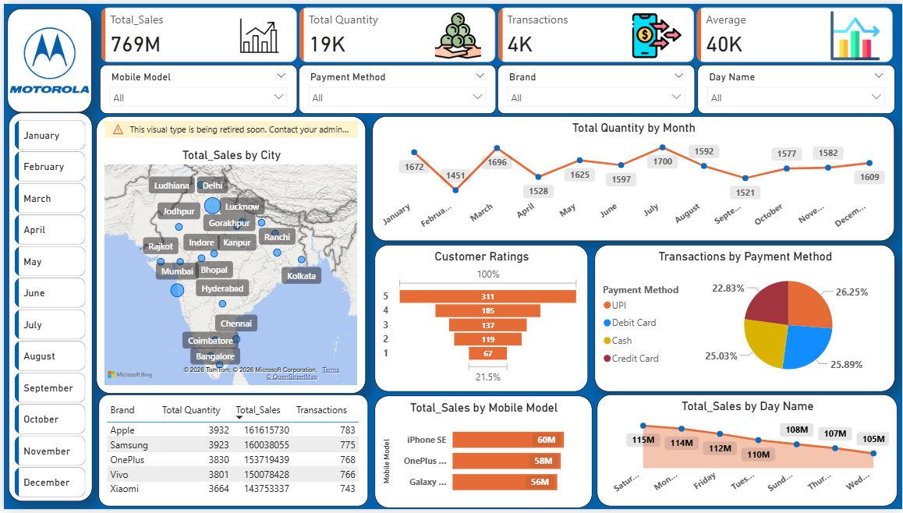

# 📱 Mobile Sales Analysis Dashboard

## 📌 Project Overview

The **Mobile Sales Analysis Dashboard** is an interactive Power BI project designed to analyze mobile phone sales performance. It provides valuable insights into sales trends, customer behavior, brand performance, payment methods, and regional sales using interactive visualizations and KPIs.

---

## 🛠️ Tools Used

- Microsoft Power BI
- Power Query
- DAX
- Data Modeling
- Interactive Visualizations

---

## 📊 Dashboard Features

- Total Sales Analysis
- Total Quantity Sold
- Total Transactions
- Average Sales Value
- Sales by City (Map)
- Monthly Sales Trend
- Sales by Day of the Week
- Customer Ratings Analysis
- Transactions by Payment Method
- Top Mobile Models
- Brand-wise Sales Performance
- Interactive Filters (Month, Mobile Model, Payment Method & Brand)

---

## 📈 Key KPIs

- 💰 Total Sales: ₹769M
- 📦 Total Quantity: ₹19K
- 🧾 Total Transactions: ₹4K
- 📊 Average Sales: ₹40K

---

## 📷 Dashboard Preview

---

## 🎯 Business Insights

- Identifies top-performing mobile brands and models.
- Tracks monthly and daily sales trends.
- Analyzes customer ratings and purchasing behavior.
- Compares different payment methods.
- Monitors city-wise sales performance.
- Supports data-driven business decisions.

---

## 📂 Project Files

- 📊 Mobile Sales Analysis Dashboard.pbix (Power BI Dashboard)
- 🖼️ Mobile Sales Dashboard.png (Dashboard Screenshot)
- 📄 Mobile Sales Dataset.xlsx (Dataset)
- 📘 README.md (Project Documentation)

---

## 👨‍💻 Author

**Hemant Rathore**

Aspiring Data Analyst | Power BI | Excel | SQL | Python

📧 Email: (hemantrathore975210@gmail.com)
🔗 LinkedIn: (www.linkedin.com/in/hemant-rathore80)
🔗 GitHub: (https://github.com/Rathore8085/project)